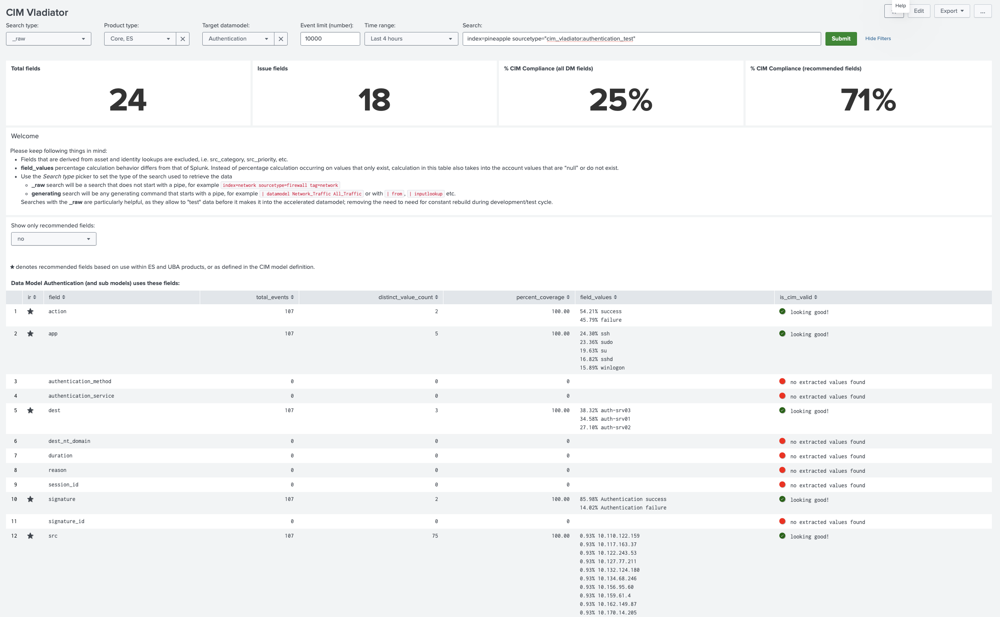
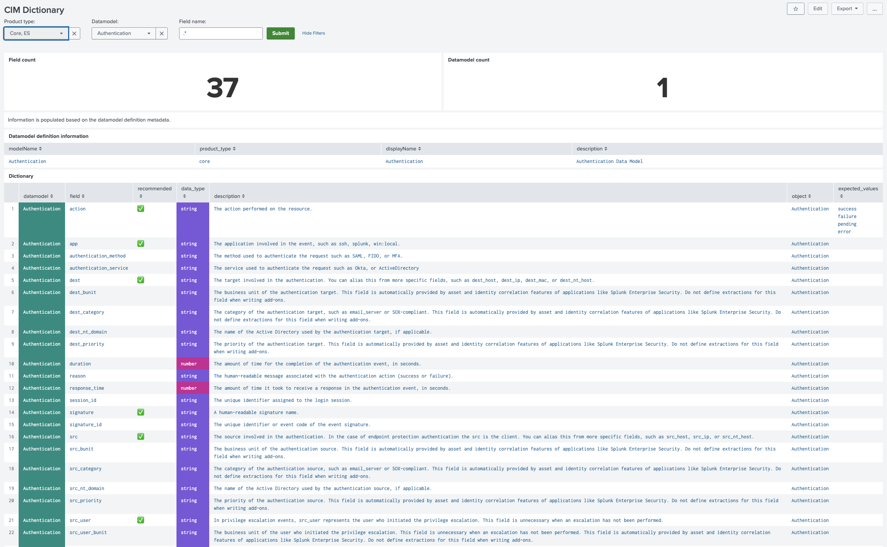

# CIM Vladiator

CIM Vladiator is a Splunk app that cuts down the time spent validating Splunk Common Information Model (CIM) compliance for technology add-ons (TAs). Instead of manually cross-checking field names, values, and coverage against the CIM specification, point this dashboard at your data and get an immediate compliance breakdown.

It helps you:

* Find fields that are required by a CIM data model but missing from your data
* Confirm that field values conform to what CIM expects (e.g. `action` should only be `success`/`failure`)
* Rapidly prototype and validate field extractions while developing a TA, without waiting for a full data model acceleration rebuild

This project is hosted on GitHub: https://github.com/hire-vladimir/SA-cim_vladiator

**CIM Compliance Dashboard** — point a search at your data, pick a CIM data model, and get a compliance score plus a field-by-field breakdown:

 Click to view larger

**CIM Dictionary** — browse the CIM specification itself: every field for a given data model, whether it's recommended, its data type, description, and expected values:

 Click to view larger

## Installation

### Customer Managed Platform (CMP) install

App installation only needs to happen on the search head. See Splunk's documentation: https://help.splunk.com/en/?resourceId=Splunk_Admin_Managingappobjects

### Splunk Cloud install

Install via Splunk Cloud's self-service app installation. See: https://help.splunk.com/en/?resourceId=SplunkCloud_Admin_SelfServiceAppInstall

### System requirements

CIM Vladiator generally targets the latest Splunk compatibility, but should function on all presently supported Splunk versions.

### Recommended placement for security customers

For most security-focused deployments, install CIM Vladiator on the **ES search head**, alongside `Splunk_SA_CIM` (Splunk's Common Information Model add-on, which provides the accelerated `Authentication`, `Network_Traffic`, etc. data models that ES itself relies on). CIM Vladiator then validates your TAs against the same data models ES is actually using — plus the bundled UBA models and any custom ones you add — without adding its own acceleration overhead.

More generally, CIM Vladiator can run on any search head that has the relevant data models, TAs, and knowledge objects installed, with search access to the data being validated — the ES search head is simply the highest-value location for security use cases since that's where `Splunk_SA_CIM` and the accelerated security data models already live.

## Usage

CIM Vladiator has two main pages: the **CIM Compliance Dashboard**, which scores your data against a CIM data model, and the **CIM Dictionary**, which is a reference browser for the CIM specification itself.

### CIM Compliance Dashboard

The dashboard is a single screen: a filter bar at the top, four summary metrics, and a field-by-field compliance table.

#### Filter bar

| Filter | What it does |
|---|---|
| **Search type** | `_raw` for a plain search (anything that doesn't start with a pipe, e.g. `index=foo sourcetype=bar`), or `generating` for a search that starts with a generating command (e.g. `\| datamodel Network_Traffic All_Traffic`, `\| from`, `\| inputlookup`, or a custom search command). `_raw` searches are the most useful during development — they let you test data against a model before it's been accelerated. |
| **Product type** | The Splunk product context for compliance scoring, e.g. `Core, ES`. |
| **Target datamodel** | The CIM data model to validate against, e.g. `Authentication`, `Network_Traffic`. |
| **Event limit (number)** | Caps how many events the search pulls back (e.g. `10000`). |
| **Time range** | Standard Splunk time range picker (e.g. `Last 60 minutes`). |
| **Search** | The actual SPL — for `_raw` mode, just an `index=... sourcetype=...` search. |

Click **Submit** to run.

> **The Search type filter is more powerful than it looks.** Because `generating` mode accepts any generating command, validation isn't limited to indexed events — you can run a `_raw` search, sure, but you can equally point CIM Vladiator at `| inputlookup` (validate a lookup table's structure against a CIM model), `| datamodel` (validate an already-accelerated data model), or a custom search command that pulls data from an external system entirely. If it produces a result set with fields, CIM Vladiator can score it against a CIM data model.

#### Summary metrics

Across the top of the results:

* **Total fields** — how many fields the selected data model defines (including sub-models)
* **Issue fields** — how many of those fields have a compliance issue (missing, no data, or unexpected values)
* **% CIM Compliance (all DM fields)** — percentage of *all* data model fields that are clean
* **% CIM Compliance (recommended fields)** — percentage of just the *recommended* fields (the ones flagged with a ★, based on usage in ES/UBA or the CIM model definition) that are clean

The "all fields" percentage is typically much lower than "recommended fields" — most CIM models define many optional fields that real-world data rarely populates, so the recommended-fields score is usually the more meaningful health check.

#### Show only recommended fields

A dropdown (`yes`/`no`) that filters the table down to just the ★ recommended fields. Useful once you've confirmed the basics are working and want to focus on the fields ES/UBA actually rely on.

#### Field compliance table

One row per CIM field, with:

* **field** — the CIM field name
* **total_events** — how many events in the search results populate this field
* **distinct_value_count** — number of distinct values seen
* **percent_coverage** — what fraction of events have this field populated
* **field_values** — top values with their percentage breakdown
* **is_cim_valid** — the verdict, one of:
  * ✅ **looking good!** — field is populated and values conform to CIM expectations
  * 🔴 **no extracted values found** — the field is defined by the data model but never appears in your data (0 events, 0 distinct values)
  * ⚠️ **event coverage less than 90%** — the field is populated, but in fewer than 90% of returned events
  * ⚠️ **found N unexpected values (...)** — the field is populated, but contains values CIM doesn't expect for that field (the unexpected values are listed)
  * ℹ️ **no validation regex was found to evaluate** — CIM Vladiator doesn't have a value-validation rule defined for this field, so it can't check `field_values` against expectations (coverage is still checked)

A few things to keep in mind while reading the table:

* Fields derived from asset/identity lookups (e.g. `src_category`, `src_priority`) are excluded — they depend on lookup configuration, not your data.
* `field_values` percentages are calculated differently than Splunk's own `top`/`stats` — the denominator includes events where the field is null or absent, not just events where it has a value.

### CIM Dictionary

While the compliance dashboard tells you how *your data* measures up, the CIM Dictionary page is a reference browser for the CIM specification itself — useful when you're not sure what a field means, whether it's recommended, or which data models it belongs to.

#### Filter bar

| Filter | What it does |
|---|---|
| **Product type** | Restrict to data models for a given product (`Core`, `Premium`, etc.), or `Any`. |
| **Datamodel** | The CIM data model to inspect, e.g. `Authentication`. |
| **Field name** | Matches field names as a regex — leave as the default `.*` to see everything, or narrow to a specific field (e.g. `^src`) to find every model that defines it. |

#### Summary metrics

* **Field count** — number of fields matching the current filters
* **Datamodel count** — number of data models matching the current filters

#### Dictionary table

One row per field, with:

* **datamodel** — which data model defines this field (and sub-model, if applicable)
* **field** — the field name
* **recommended** — ✅ if it's a recommended field (the same ★ designation used on the compliance dashboard)
* **data_type** — `string`, `number`, etc.
* **description** — what the field represents, taken from the CIM spec
* **object** — the CIM object/sub-model the field belongs to
* **expected_values** — for fields with a constrained value set (e.g. `action` → `success` / `failure` / `pending` / `error`), the values CIM considers valid — this is exactly what the compliance dashboard checks `field_values` against when flagging "unexpected values"

## Best practices & use cases

### Validating an Authentication source

Say you're building a TA for an authentication data source (VPN, SSH, AD, etc.) and want to check it against the CIM `Authentication` model before shipping.

1. Set **Search type** to `_raw` and **Search** to `index=<your_index> sourcetype=<your_sourcetype> tag=authentication`. The `tag=authentication` constraint tells the tool to evaluate only the events within that sourcetype that are actually tagged for the `Authentication` model — not every other event type the sourcetype might carry.
2. Set **Product type** to `Core, ES` and **Target datamodel** to `Authentication`.
3. Pick an **Event limit** and **Time range** that cover a representative sample of your data.
4. Click **Submit**.

From the results:

* Check **% CIM Compliance (recommended fields)** first — this is your headline number. In the screenshot above it's 71%, with 25% across all data model fields.
* Scroll the field table looking for non-green `is_cim_valid` rows:
  * If a recommended field like `src_user` shows **"no extracted values found"**, your field extractions aren't populating that field at all — that's a gap to fix in `props.conf`/`transforms.conf`.
  * If a field like `user` shows **"found 1 unexpected values ()"**, your extraction is producing values CIM doesn't expect for that field — e.g. an empty string — which usually means a regex needs tightening.
  * Fields marked **"looking good!"** (e.g. `action`, `app`, `dest`, `signature`, `src`) need no further work — `action` correctly showing only `success`/`failure`, `signature` showing CIM-style values like `Authentication success`/`Authentication failure`, etc.
5. Toggle **Show only recommended fields** to `yes` once the basics pass, to focus remaining effort on the fields ES/UBA actually consume.

### Recommended workflow: one sourcetype/tag at a time, then widen

This is most effective when you constrain the **Search** to a single sourcetype and tag combination at a time — e.g. `index=<your_index> sourcetype=<sourcetype_a> tag=authentication` — and drive that one feed to a high compliance score before moving on. Trying to fix everything across a whole index at once makes it hard to tell which sourcetype's extractions are causing which issues.

The progression looks like:

1. Pick one sourcetype, get it to a high **% CIM Compliance (recommended fields)** score, fix its flagged fields.
2. Move to the next sourcetype for the same data model (keeping `tag=authentication`), repeat.
3. Once every feed that maps to a given CIM model is individually compliant, broaden the **Search** to cover multiple sourcetypes at once by dropping the `sourcetype=` constraint (keep `tag=authentication` to stay scoped to the right events) — at that point CIM Vladiator becomes a fleet-wide health check across all your compliant feeds, rather than a per-feed debugging tool.

Repeat against `Network_Traffic` or other relevant models for the rest of your TA's sourcetypes.

### Flexibility: validate against your own schema

CIM Vladiator isn't limited to Splunk's published CIM data models. **Target datamodel** accepts any data model defined on your search head — including ones you write yourself. If your TA or app has a schema that's specific to your data (a custom field set that doesn't map cleanly to an existing CIM model, or an internal standard your team enforces), express it as a Splunk data model and CIM Vladiator will validate your data against it exactly the same way it validates against `Authentication` or `Network_Traffic`: compliance percentages, per-field coverage, and `is_cim_valid` checks.

This makes the tool useful well beyond "is my TA CIM-compliant" — it becomes a general-purpose schema-conformance checker for whatever data models your environment defines.

Note that CIM Vladiator only uses the data model as a **schema definition** — the field list, types, and expected values it validates against. The data model itself does **not** need to be accelerated for this to work; acceleration is a Splunk feature for speeding up `| tstats` and pivot queries over historical data, and is unrelated to whether CIM Vladiator can read the model's field definitions and check your search results against them.

**Bundled UBA data models** — CIM Vladiator ships with the UBA (User Behavior Analytics) data models for this same purpose — they're included as ready-made schemas to validate against, not because the app depends on UBA itself. Importantly, **these data models are not accelerated**, so having them present doesn't consume additional search head resources (no summary indexing, no acceleration jobs). They're just definitions sitting there for CIM Vladiator (or you) to validate against on demand.

### Looking up what a flagged field actually means

Say the compliance dashboard flagged the `action` field as having unexpected values, while you were checking your data against the **Authentication** data model. To find out what values that field is *supposed* to contain, switch to the CIM Dictionary page, set **Datamodel** to the same model you were checking (**Authentication**), and set **Field name** to `^action$`. The `expected_values` column shows you the values your data should be using (e.g. `success`, `failure`, `pending`, `error`) — turning a vague "unexpected value" warning into a concrete fix.

**Field name** accepts regex, which makes it useful for broader lookups too:

* Just typing a plain field name (e.g. `user`) searches as if wildcards surround it (`.*user.*`) — i.e. "contains" — so it'll match `user`, `src_user`, `dest_user`, `vendor_user_id`, etc.
* `^src` anchors the match to the start, returning every `src_*` field — `src_user`, `src_ip`, `src_mac`, and so on — handy for seeing everything CIM tracks about the source side of an event.
* `^action$` anchors both ends for an exact match on just `action`.
* `.*_user` matches anything ending in `_user` — `src_user`, `dest_user` — useful when you want a specific role across the model regardless of prefix.

This also works in reverse: set **Datamodel** to `Any` and **Field name** to `^src`, to see every data model that defines a field starting with `src` — handy when deciding where a new TA's fields should map.

## Special Thanks

Thank you to Lowell Alleman for python3 support, Annette Quach for UBA support.

## Legal

* *Splunk* and the *Splunk>* logo are trademarks or registered trademarks of Cisco and/or its affiliates in the U.S. and other countries.
